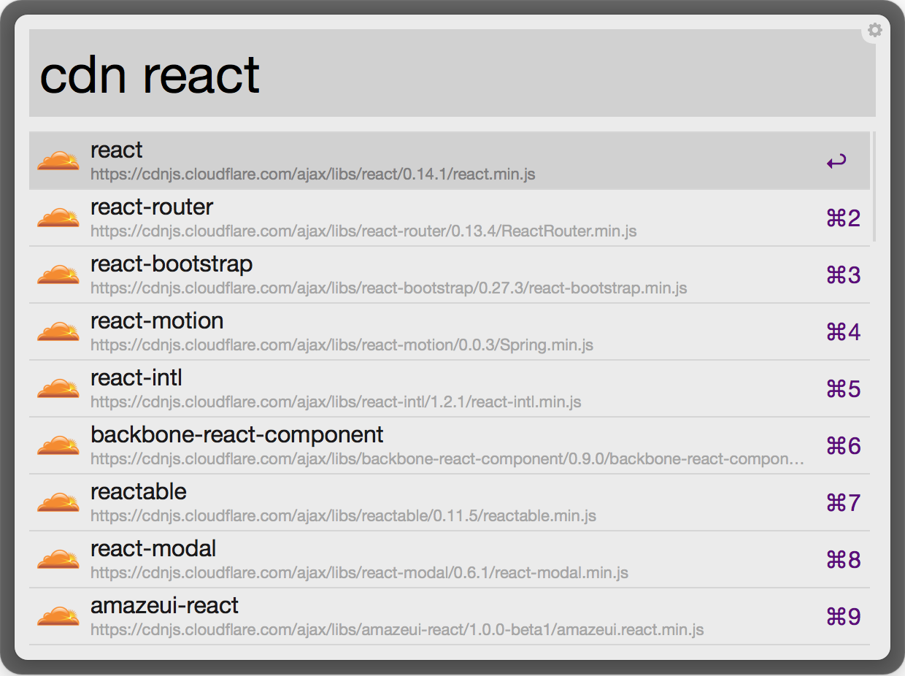

#CDN Workflow for Alfred 2
Find CDNs quick with Alfred. The keyword is "cdn" (example ```cdn ember```).



[Download]()

##Commands
````
cdn {query}
````

###Please leave issues if you encounter any problems or star this repo if you found it useful :)
